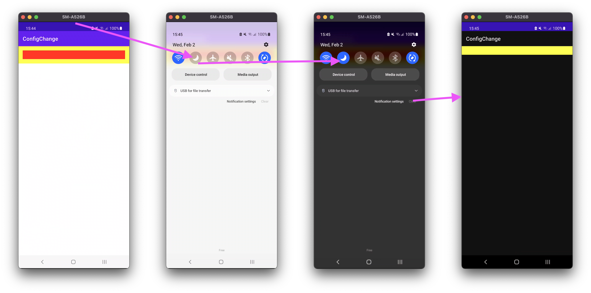

Disappearing view on config change
==================================

The layout is:
```
RecyclerView
    \---- Child Item with FragmentContainer (R.layout.item_container_yellow)
            \---- Fragment (R.layout.item_content_red) 
```

* The main activity has one view (`RecyclerView`).
* The `RecyclerView` has an adapter with one element: this item uses `R.layout.item_container_yellow`
* This container view contains one view: a `FragmentContainerView` containing a `ItemContentRed`
* The `ItemContentRed` fragment uses `R.layout.item_content_red`
* This content view contains one view: a `View` which is a red rectangle of `match_parent` width and `32dp height`.


Steps to reproduce:
* Launch the app
  - The app displays correctly: you see a yellow container around a red rectangle
* Toggle day mode on or off:
  - Expected behavior: You continue to see the yellow container around a red rectangle
  - Actual behavior: You don't see the red content rectangle anymore


